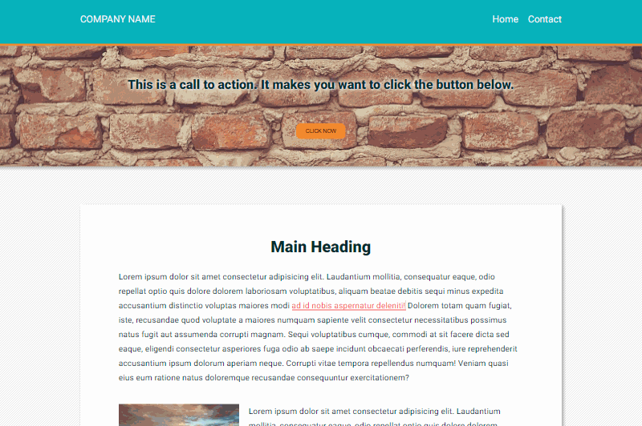

# Assignment 7: Add CSS Transitions and Animations to a Webpage

(**NOTE:** View a rendered version of this file in VS Code with `ctrl-shift-v` or `cmd-shift-v`)

&nbsp;

&nbsp;
## Background

In this assignment, you will use CSS animations and transitions to create micro-interactions for your website. This assignment is designed to help you practice adding motion and visual feedback to enhance user experience.

&nbsp;
## Setup

Create a git repository titled `m7-hw7-lastname-firstname` and clone the repo to your computer. Copy the **contents** of the `unsolved` folder into your repository. Ensure the `index.html` file is in the **root** of your repository so that it deploys to GitHub pages properly.

&nbsp;
## Instructions

Use the provided code in the `unsolved` folder to implement micro interactions using CSS transitions and animations on the webpage. In order to receive full-credit for this assignment, you must create **unique** animations and transitions triggered on hover for:

1. The links in the page header.
1. The button in the hero section.
1. The links in the lorem text in the main content of the page.

**You must use at least one CSS transition and animation to receive full-credit.**

You may use the example gif at the top of these instructions as inspiration for your animations and transitions. However, you do not have to exactly re-create the same animations and transitions seen in the example. You are free to create your own micro interactions.

**DO NOT use any external animation libraries for this assignment.**

&nbsp;
## Deployment

Your code must be deployed to GitHub Pages. To deploy a repository to GitHub pages you must:

1. Ensure your repository has an `index.html` file in the root directory.
1. Navigate to the `settings` section of the repository.
1. Click on `pages` in the left navigation menu.
1. Under `source` click the dropdown and select your `master` or `main` branch.
1. Click `save`.

Your site should be deployed to `<your github username>.github.io/<your repository name>` in 5-10 minutes.

&nbsp;
## Submission

Please submit both a link to your repository and a link to the live site. Also please include any comments on stumbling blocks or difficulties encountered while completing the assignment.

Website URL: https://fell67.github.io/m7-hw7-abreu-victoria/
